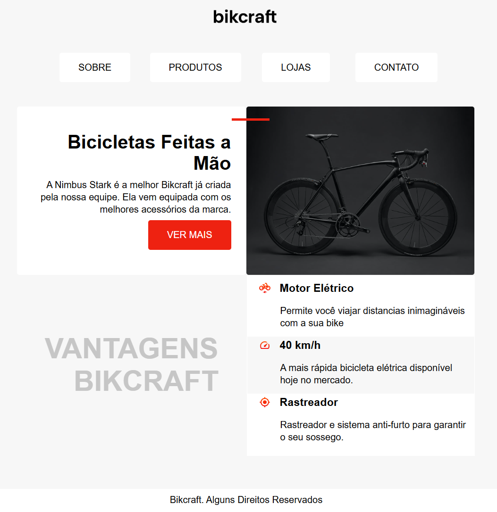
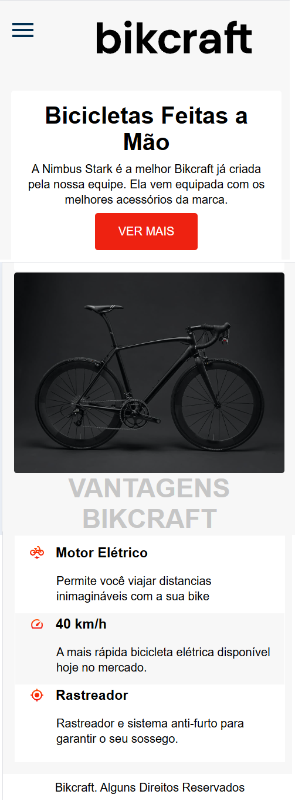
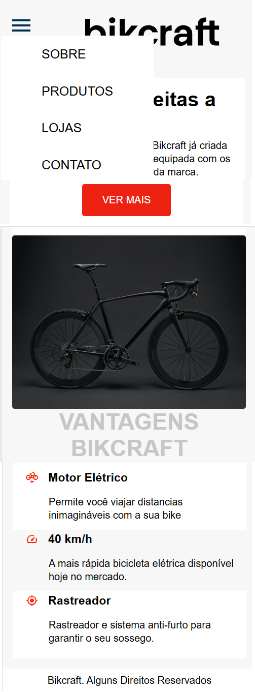

### Revisão de Web - Html, CSS

# Bikcraft Landing Page - Origamid - Refatorado  

### Curso Origamid: "Html e Css para Iniciantes"

Projeto utilizado para revisar Responsividade e Mobile First, simulando uma situação real aonde o cliente fornece todas as características de um site a partir de um design pronto do Figma.
O curso forneceu o design pronto de uma landing page com o tema de bicicletas, e eu refatorei totalmente o css para o mobile first e a apliquei a responsividade de forma livre.
Neste projeto não há aplicação de frameworks ou bibliotecas, apenas css e html.
Baseado no Curso ["HTML e CSS para Iniciantes"](https://www.origamid.com/curso/html-e-css-para-iniciantes/), da [Origamid](https://www.origamid.com).

Sites ferramentas:

- [Flat Icon](https://www.flaticon.com/br/) "favicon"
- [Google fonts](fonts.google.com) "fontes online"
- [Netlify](netlify.com) "hospedagem gratuita do site"
- [Origamid](https://www.origamid.com) "aprendizado"
- [Figma](https://www.figma.com) "design do projeto"

Site Hospedado: [sk8bikcraft](https://sk8bikcraft.netlify.app/).
